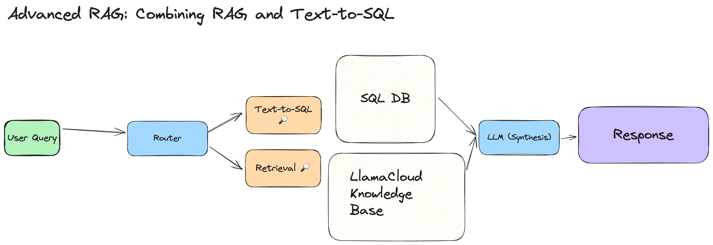
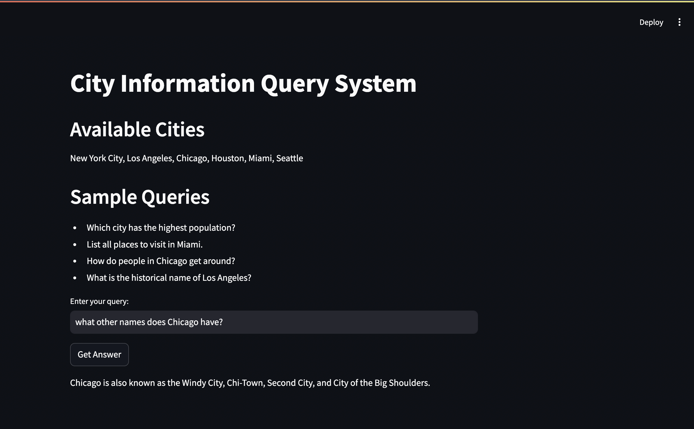

# RAG and Text-to-SQL Query System

A versatile, interactive system that combines SQL databases and LlamaIndex for natural language querying of both structured and unstructured data. The system features Retrieval-Augmented Generation (RAG) capabilities and Text-to-SQL conversion, supporting both predefined datasets and custom data uploads.

## 🔷 High-Level Overview

Below is an architectural overview of the system:


## 🌟 Features

### City Information Query System
- **Text-to-SQL Conversion**: Query structured data using natural language
  - Pre-loaded city database with population and state information
  - Includes data for major US cities: New York City, Los Angeles, Chicago, Houston, Miami, Seattle
  - Query statistics like population, state location, and city comparisons
- **RAG Integration with LlamaCloud**: Enhanced responses using LlamaIndex Cloud API
  - Rich contextual information about each city
  - Historical facts and cultural insights
  - Transportation and lifestyle details
  - Tourist attractions and points of interest
  - Cloud-hosted index for efficient retrieval
- **Pre-loaded Database**: Example dataset demonstrating system capabilities
  - Structured SQL database with city statistics
  - Unstructured knowledge base with detailed city information
  - Seamless integration between statistical and contextual data


## 🚀 Getting Started

### Prerequisites
```
python >= 3.8
streamlit
llama-index
pandas
sqlalchemy
python-dotenv
```

### Installation

1. Clone the repository
```bash
git clone https://github.com/yourusername/rag-sql-query-system.git
cd rag-sql-query-system
```

2. Install dependencies
```bash
pip install -r requirements.txt
```
3. Load Documents into LlamaCloud

Download the following Wikipedia pages into PDFs by either pressing Ctrl-P/Cmd-P or right-clicking and selecting "Print" and then "Save as PDF" as the destination (These are available in the data folder). 
- [New York City](https://en.wikipedia.org/wiki/New_York_City)
- [Los Angeles](https://en.wikipedia.org/wiki/Los_Angeles)
- [Chicago](https://en.wikipedia.org/wiki/Chicago)
- [Houston](https://en.wikipedia.org/wiki/Houston)
- [Miami](https://en.wikipedia.org/wiki/Miami)
- [Seattle](https://en.wikipedia.org/wiki/Seattle)

After that, create a new index in LlamaCloud and upload your PDFs.


4. To Set up your environment variables, create a `.streamlit/secrets.toml` file:
```toml
[api_keys]
OPENAI_API_KEY = "your-openai-key"
PHOENIX_API_KEY = "your-phoenix-key"
LLAMA_CLOUD_API_KEY = "your-llama-cloud-key"
ORGANIZATION_ID = "your-org-id"

[llama_cloud]
INDEX_NAME = "your-index-name"
PROJECT_NAME = "your-project-name"
```

5. Run the application
```bash
streamlit run app.py
```

6. Jupyter Notebook
Go through `llamacloud_sql_router.ipynb` for Jupyter Notebook version (this does not include streamlit UI)

## 💡 Usage

### Default Mode 
1. Enter your natural language query
2. System automatically determines whether to use SQL or RAG
3. View results formatted in markdown

### Sample Queries
- Structured Data: "What are the highest values in the dataset?"
- Unstructured Data: "Summarize the key points from the documents."
- Combined: "Compare the statistical data with the contextual information."

## 🏗 Project Structure

```
rag-sql-query-system/
├── app.py                 # Main Streamlit application
├── sql_router.py          # Router and tool definitions
├── .streamlit/
│   └── secrets.toml       # API keys and configurations
├── requirements.txt       # Project dependencies
└── README.md             # Project documentation
```

## 🔒 Security

- API keys and sensitive information are stored in `.streamlit/secrets.toml`
- The secrets file is excluded from version control
- Environment variables are used for deployment
- Different keys should be used for development and production

## 🛠 Technical Details

### Components
- **Streamlit**: Web interface and user interaction
- **SQLAlchemy**: Database management and SQL queries
- **LlamaIndex**: RAG implementation and document processing
- **OpenAI**: Natural language understanding and generation

### Tools
1. **Text-to-SQL Tool**
   - Converts natural language to SQL queries
   - Handles structured data queries
   - Supports dynamic schema adaptation

2. **RAG Tool**
   - Implements Retrieval-Augmented Generation
   - Processes unstructured documents
   - Provides contextual information retrieval

## 📸 Running the App
Once the application is launched, you should see a Streamlit interface like this:



## 🤝 Contributing

1. Fork the repository
2. Create your feature branch (`git checkout -b feature/AmazingFeature`)
3. Commit your changes (`git commit -m 'Add some AmazingFeature'`)
4. Push to the branch (`git push origin feature/AmazingFeature`)
5. Open a Pull Request


